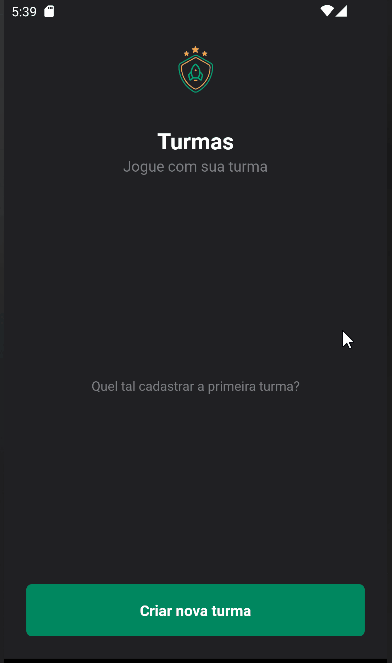

# IGNITE TEAMS

## **_Descrição do projeto_**

Projeto incrível do Ignite React Native, onde pude praticar navegation, styled-components, localStorage entre outras boas ferramentas.

Práticas como salvar, pegar e redefinir dados no localStorage, uso de hooks e bastante estilização com styled-componets. Além de implementar melhores para a experiência do usuário, como: tratamento de erros, acionamento no botão do teclado do aparelho, tela de loading para informar ao usuário que os dados estão sendo carregados (caso necessário).

Todo o código segue um projeto definido no Figma. Para isso temos um em theme para definar as cores, tamanho de fonte e familia da fonte.

Além de tudo que foi proposto nas aulas, resolvi adcionar um contador de players cadastrados em sua respectiva turma.
Este valor está disponível no próprio card da turma.
 

#

## **_Recursos_**

- [React Native](https://reactnative.dev/docs/getting-started)
- [Expo](https://docs.expo.dev)
- [Styled-components](https://styled-components.com/docs/basics)
- [Navigation](https://reactnavigation.org/docs/getting-started/)
- [Android Studio (Device: Nexus 5X API 33)](https://developer.android.com)

#

 

